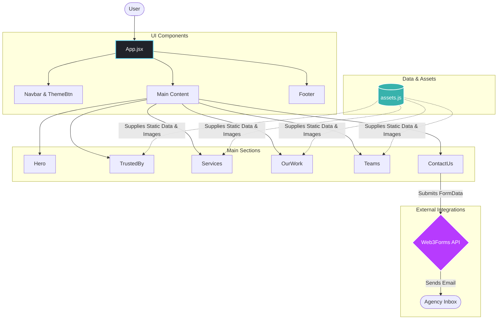

# 🚀 LumenForge | Agency AI Website


A modern, high-performance marketing website designed for digital agencies. Built with the bleeding-edge stack of React 19, Vite 7, and Tailwind CSS v4, this project delivers smooth animations, dynamic theming, and a seamless user experience.

## ✨ Key Features
*   **Dynamic UI Sections:** Beautifully animated Hero, Services, Work, Team, and Contact sections.
*   **Dark/Light Mode:** Seamless theme toggle with system preference detection and ARIA accessibility.
*   **Smooth Animations:** Scroll and component-level animations powered by the `Motion` library.
*   **Custom Cursor:** Fine-pointer optimized custom cursor with automatic lifecycle management.
*   **Working Contact Form:** Integrated with [Web3Forms](https://web3forms.com/) for immediate email routing.
*   **Toast Notifications:** Real-time feedback via `react-hot-toast`.

---
Live Link - [LumenForge](https://lumen-forge-cyan.vercel.app/)
---
## 🏗️ Architecture & System Flow

The application follows a clean, component-based architecture. Static data is abstracted into a central assets module, keeping UI components lightweight and focused on rendering.

### System Flow Diagram



### Flow Description:
1. **User Interaction:** The user interacts with the single-page application routed through `App.jsx`.
2. **Data Hydration:** Components like *Services*, *OurWork*, and *Teams* pull static content and image references directly from `src/assets/assets.js`, acting as a local CMS.
3. **Form Submission:** When a user submits the `ContactUs` form, the payload is intercepted, validated, and sent to the **Web3Forms API**, which securely routes it to the configured email address using the `.env` access key.

---

## 🛠️ Tech Stack

*   **Frontend Framework:** React 19
*   **Build Tool:** Vite 7
*   **Styling:** Tailwind CSS v4 (Utility-first + custom theme variables)
*   **Animations:** Motion Library
*   **Notifications:** `react-hot-toast`
*   **Code Quality:** ESLint 9

---

## 🚀 Getting Started

Follow these steps to set up the project locally.

### 1. Clone & Install Dependencies
```bash
git clone <your-repo-url>
cd lumenforge
npm install
```

### 2. Configure Environment Variables
Create a `.env` file in the root of your project. You can copy the template from `.env.example`.
```env
VITE_WEB3FORMS_ACCESS_KEY=your_web3forms_access_key_here
```
> *Note: Get your free access key from [Web3Forms](https://web3forms.com/).*

### 3. Available Scripts
*   `npm run dev` - Starts the Vite development server.
*   `npm run build` - Compiles and minifies for production.
*   `npm run preview` - Previews the production build locally.
*   `npm run lint` - Runs ESLint checks.

---

## 📂 Folder Structure

```text
.
├── public/                 # Static public assets
├── src/
│   ├── assets/
│   │   └── assets.js       # Centralized static data & image exports
│   ├── components/         # Reusable UI components
│   │   ├── ContactUs.jsx
│   │   ├── Footer.jsx
│   │   ├── Hero.jsx
│   │   ├── Navbar.jsx
│   │   ├── OurWork.jsx
│   │   ├── ServiceCard.jsx
│   │   ├── Services.jsx
│   │   ├── Teams.jsx
│   │   ├── ThemeBtn.jsx
│   │   ├── Title.jsx
│   │   └── TrustedBy.jsx
│   ├── App.jsx             # Root component & Layout
│   ├── index.css           # Global styles & Tailwind configuration
│   └── main.jsx            # React mounting point
├── index.html
├── package.json
└── vite.config.js
```

---

## 🎨 Customization Guide

Make this template your own by modifying the following:

*   **Branding & Logos:** Replace the existing logo files inside `src/assets/`.
*   **Theme Colors:** Adjust the primary theme color by editing the `--color-primary` CSS variable in `src/index.css`.
*   **Content Management:** Edit Team members, Client Logos, and Services directly inside `src/assets/assets.js`.
*   **SEO & Meta:** Update the website `<title>` and `<meta>` tags inside `index.html`.

---

## ⚡ Recent Optimizations
*   Migrated from lowercase motion tags to proper `Motion` wrapper components for improved performance.
*   Optimized custom cursor lifecycle within `App.jsx` to eliminate stale animation frames.
*   Implemented pointer-type guards so the custom cursor logic only executes on fine-pointer devices (desktops).
*   Enhanced theme toggle accessibility with strict button semantics and `aria-label`s.
*   Secured Web3Forms integration via strict environment variable masking.

---

## 📌 Important Notes

*   **Custom Cursor:** This project features a globally hidden default cursor in favor of a custom animated one. If your specific audience requires standard cursors for accessibility, remove `cursor: none` from `src/index.css` and disable the cursor logic in `App.jsx`.

## 📜 License

This project is open for learning, portfolio, and demo use. 
*(Please add your preferred official license, e.g., MIT, before distributing for production).*
